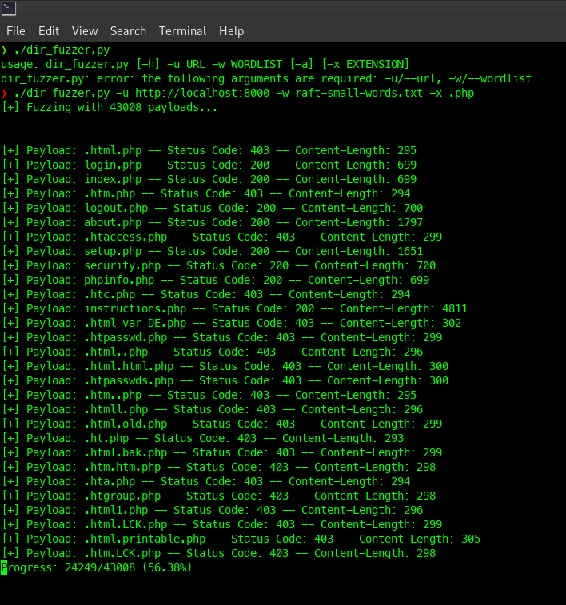

# Directory Fuzzer

Quick and dirty little directory fuzzer I threw together to learn about the Python Requests library and practice scripting with it.

```
usage: dir_fuzzer.py [-h] -u URL -w WORDLIST [-a] [-x EXTENSION]

Fuzzing tool for fuzzing directories

options:
  -h, --help            show this help message and exit
  -u URL, --url URL     url to fuzz
  -w WORDLIST, --wordlist WORDLIST
                        wordlist to load
  -a, --all             display all error codes (usually WAY too verbose)
  -x EXTENSION, --extension EXTENSION
                        extension to append to payload (e.g., .php,.aspx,.pdf)

Displays responses to status codes 200,204,301,302,307,401,403 by default.
EXAMPLE:
        $ ./dir_fuzzer.py -u http://www.example.com -w raft_small_words.txt -x .php
```

## Usage Example

